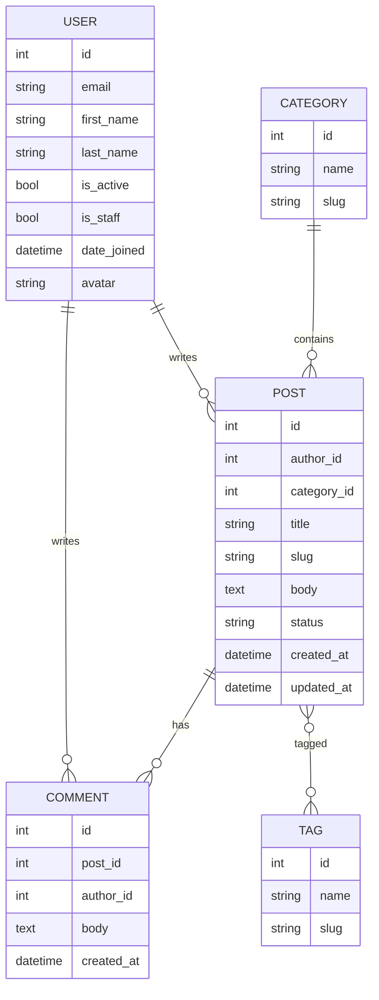

```mermaid
erDiagram

USER {
    int id
    string email
    string first_name
    string last_name
    bool is_active
    bool is_staff
    datetime date_joined
    string avatar
}

CATEGORY {
    int id
    string name
    string slug
}

TAG {
    int id
    string name
    string slug
}

POST {
    int id
    int author_id
    int category_id
    string title
    string slug
    text body
    string status
    datetime created_at
    datetime updated_at
}

COMMENT {
    int id
    int post_id
    int author_id
    text body
    datetime created_at
}

USER ||--o{ POST : writes
USER ||--o{ COMMENT : writes
CATEGORY ||--o{ POST : contains
POST ||--o{ COMMENT : has
POST }o--o{ TAG : tagged
```
